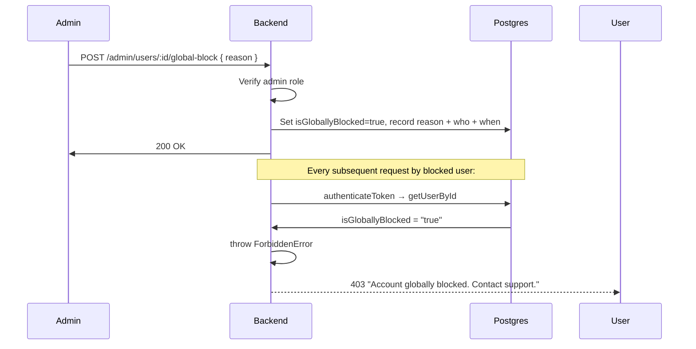

# 🛡️ Admin & Blocking

> Covers global user blocking (admin-only) and user-to-user blocking.

---

## Two Types of Blocking

|                 | User Block        | Global Block          |
| --------------- | ----------------- | --------------------- |
| Who sets it     | Any user          | Admin only            |
| Scope           | Between two users | Entire platform       |
| Blocks login    | ❌                | ✅                    |
| Reason required | ❌                | ✅                    |
| Audit trail     | Limited           | Full (who, when, why) |
| Reversible by   | Either user       | Admin only            |

---

## Global Block (Admin)

Permanently locks a user out of the entire platform. Blocked users cannot:

- Log in
- Access any API endpoint
- Connect via WebSocket
- Make or receive calls
- Send or receive messages

### Block a user

```
POST /api/admin/users/:userId/global-block
Authorization: Bearer <admin-token>

Body: { "reason": "Repeated spam after warnings" }

Response 200:
{
  "data": {
    "id": "uuid",
    "username": "spammer123",
    "status": "blocked",
    "isGloballyBlocked": "true",
    "globalBlockReason": "Repeated spam after warnings",
    "globalBlockedAt": "2026-03-16T07:00:00Z",
    "globalBlockedBy": "admin-uuid"
  }
}
```

### Unblock a user

```
POST /api/admin/users/:userId/global-unblock
Authorization: Bearer <admin-token>
```

### List all globally blocked users

```
GET /api/admin/users/global-blocked/list?limit=100&offset=0
Authorization: Bearer <admin-token>
```

---

## Global Block Flow



### Where the block is enforced

| Point             | Code Location                                    |
| ----------------- | ------------------------------------------------ |
| Login             | `user.service.ts → authenticateUser()`           |
| Every API request | `auth.middleware.ts → authenticateToken()`       |
| Password reset    | `user.service.ts → generatePasswordResetToken()` |

---

## User-to-User Block

Used by regular users to block specific people from calling or messaging them.

```
POST   /api/users/:userId/user-block     Block this user
DELETE /api/users/:userId/user-unblock   Unblock this user
GET    /api/users/blocked/list           List your blocked users
```

**Effect of user block:**

- Blocked user's call initiation fails with `403`
- Blocked user's messages fail with `403 Unable to send message`
- Checked in both `callSession.service.ts` and `message.service.ts`

---

## Admin Workflow

```bash
# 1. Find user
GET /api/admin/users?search=spammer123

# 2. Review their activity (calls, messages)
GET /api/admin/users/:userId

# 3. Block with reason
POST /api/admin/users/:userId/global-block
{ "reason": "Harassment reported by 3 users" }

# 4. Verify block applied
GET /api/admin/users/global-blocked/list
```

```bash
# Unblock when resolved
POST /api/admin/users/:userId/global-unblock
```

---

## Error Responses

| Scenario                           | Status | Message                                    |
| ---------------------------------- | ------ | ------------------------------------------ |
| Non-admin tries to block           | 403    | Admin access required                      |
| User already blocked               | 400    | User is already globally blocked           |
| User not found                     | 404    | User not found                             |
| Blocked user logs in               | 403    | Account globally blocked. Contact support. |
| Blocked user accesses API          | 403    | Account globally blocked. Contact support. |
| Trying to unblock non-blocked user | 400    | User is not globally blocked               |

---

## Audit Queries (PostgreSQL)

```sql
-- Count all blocked users
SELECT COUNT(*) FROM users WHERE is_globally_blocked = 'true';

-- Recent blocks
SELECT username, global_block_reason, global_blocked_at
FROM users
WHERE is_globally_blocked = 'true'
ORDER BY global_blocked_at DESC
LIMIT 10;

-- Blocks per admin
SELECT global_blocked_by, COUNT(*)
FROM users
WHERE is_globally_blocked = 'true'
GROUP BY global_blocked_by;
```

---

## Use Cases for Global Block

**Use global block for:**

- Spam / bot activity
- Repeated harassment after warnings
- Compromised / malicious accounts
- Legal / law enforcement requirements

**Don't use global block for:**

- Minor first-time offences → issue a warning instead
- Payment issues → use subscription management
- Temporary abuse → use a timed suspension (future feature)
