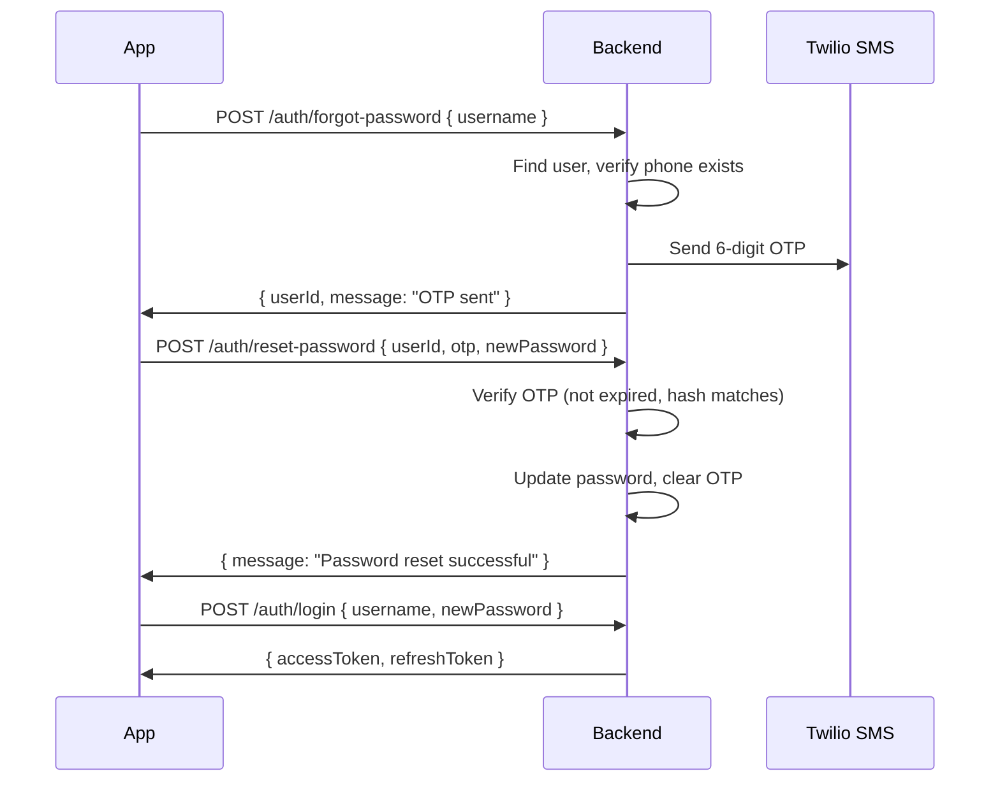

# 🔐 Authentication

> Covers registration, phone verification, login, password reset, and token management.

---

## How It Works

```
Register (phone required)
        │
        ▼
OTP sent via SMS → verify-phone
        │
        ▼
Account activated (status: active)
        │
        ▼
Login → accessToken + refreshToken
```

All protected routes require:

```
Authorization: Bearer <accessToken>
```

Tokens: `accessToken` expires in ~59 min · `refreshToken` in 7 days.

---

## Registration Flow

### Step 1 — Register

```
POST /api/auth/register

Body:
{
  "username": "john_doe",      // 3–50 chars, required
  "password": "secret123",     // 6–100 chars, required
  "phone": "+919876543210",    // E.164 format, REQUIRED
  "email": "j@example.com"    // optional
}

Response 201:
{
  "data": {
    "token": "eyJ...",                        // temp token for verify-phone
    "user": { "id": "uuid", "status": "pending_verification" },
    "message": "OTP sent to your phone. Verify to activate your account."
  }
}
```

> Account is `pending_verification` until phone is confirmed. Login will be blocked.

---

### Step 2 — Verify Phone

```
POST /api/auth/verify-phone
Authorization: Bearer <token from registration>

Body: { "otp": "123456" }

Response 200:
{ "message": "Phone number verified successfully" }
```

> OTP expires in **10 minutes**. Stored as SHA-256 hash — never plain text.

### Resend OTP

```
POST /api/auth/resend-phone-verification
Authorization: Bearer <token>
```

### Check Verification Status

```
GET /api/auth/phone-verification-status
Authorization: Bearer <token>

Response: { "hasPhone": true, "isPhoneVerified": true, "phone": "+91****3210" }
```

---

## Login

```
POST /api/auth/login

Body: { "username": "john_doe", "password": "secret123" }

Response 200:
{
  "data": {
    "accessToken": "eyJ...",
    "refreshToken": "eyJ..."
  }
}
```

**Login will fail if:**

- Phone is not verified (`pending_verification`)
- Account is globally blocked
- Account is `deleted`

---

## Password Reset (OTP-based)



### Step 1 — Request OTP

```
POST /api/auth/forgot-password

Body: { "username": "john_doe" }

Response 200:
{
  "data": {
    "userId": "abc-123-def",
    "message": "OTP sent to your registered phone number."
  }
}
```

> Always returns success even if the username doesn't exist (prevents user enumeration).

### Step 2 — Reset Password

```
POST /api/auth/reset-password

Body:
{
  "userId": "abc-123-def",
  "otp": "123456",
  "newPassword": "newpass123"
}

Response 200:
{ "message": "Password reset successful. You can now login." }
```

**Error cases:**

| Error                 | Response                             |
| --------------------- | ------------------------------------ |
| No verified phone     | 400 `No verified phone number found` |
| Invalid OTP           | 400 `Invalid verification code`      |
| Expired OTP           | 400 `Verification code has expired`  |
| Globally blocked user | 403 `Account globally blocked`       |

---

## Profile & Password Change

```
GET  /api/auth/profile          → full user profile + usage stats + QR codes
POST /api/auth/change-password  Body: { "oldPassword", "newPassword" }
```

---

## Phone Verification (standalone)

For users who want to add/change their phone after registration:

```
POST /api/auth/send-phone-verification
Authorization: Bearer <token>
Body: { "phone": "+919876543210" }
```

---

## User Account Statuses

| Status                 | Can Login | Description                         |
| ---------------------- | --------- | ----------------------------------- |
| `pending_verification` | ❌        | Just registered, phone not verified |
| `active`               | ✅        | Phone verified, account active      |
| `blocked`              | ❌        | Blocked by admin                    |
| `deleted`              | ❌        | Account removed                     |

---

## Security Details

| Feature               | Implementation              |
| --------------------- | --------------------------- |
| Password hashing      | bcrypt                      |
| Phone / email storage | AES-256 encrypted           |
| OTP storage           | SHA-256 hashed              |
| OTP expiry            | 10 minutes                  |
| JWT signing           | HS256, secret from env      |
| Global block check    | Every authenticated request |

---

## Development Testing

In dev mode (no Twilio configured), OTPs are printed to server console:

```
📱 SMS OTP for +919876543210: 123456
```

```bash
# Register
curl -X POST http://localhost:9001/api/auth/register \
  -H "Content-Type: application/json" \
  -d '{"username":"testuser","password":"pass123","phone":"+919876543210"}'

# Verify phone (check console for OTP)
curl -X POST http://localhost:9001/api/auth/verify-phone \
  -H "Authorization: Bearer TOKEN_FROM_REGISTER" \
  -H "Content-Type: application/json" \
  -d '{"otp":"123456"}'

# Login
curl -X POST http://localhost:9001/api/auth/login \
  -H "Content-Type: application/json" \
  -d '{"username":"testuser","password":"pass123"}'
```

---

## Environment Variables

```env
JWT_SECRET=your_jwt_secret_here
ENCRYPTION_KEY=your_32_byte_hex_key

# Twilio (required for SMS in production)
TWILIO_ACCOUNT_SID=ACxxxxxxxxxxx
TWILIO_AUTH_TOKEN=your_auth_token
TWILIO_PHONE_NUMBER=+1234567890
```
