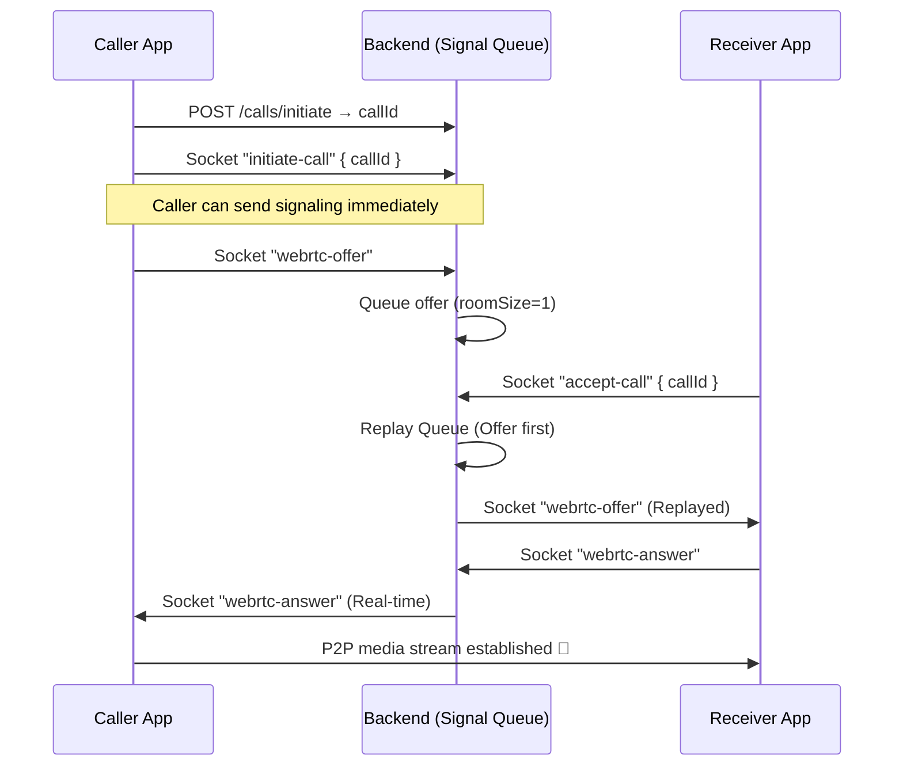

# 📞 Calls & WebRTC

> Covers QR-based call initiation, WebRTC signaling, call lifecycle, and push notification fallback for offline receivers.

---

## How It Works

```
Caller scans QR → POST /calls/initiate → callId
        │
        └─ Socket: emit "initiate-call" { callId }
                   │
            ┌──────┴──────┐
         Receiver       Receiver
          online         offline
            │               │
       "incoming-call"  FCM high-priority push
       via socket       → wakes device
            │               │
            └──────┬─────────┘
                   │
           emit "accept-call" / "reject-call"
                   │
           WebRTC negotiation (offer/answer/ICE)
                   │
           P2P media stream established 🎤📹
```

---

## Step-by-Step Integration

### 1. Get ICE config (once on app startup)

```
GET /api/webrtc/config

Response:
{
  "data": {
    "iceServers": [
      { "urls": "stun:stun.l.google.com:19302" },
      { "urls": "turn:your-turn-server", "username": "...", "credential": "..." }
    ]
  }
}
```

Use this to initialize `RTCPeerConnection`.

### 2. Connect the socket

```javascript
import { io } from 'socket.io-client';

const socket = io('wss://your-domain.com', {
  path: '/socket.io',
  transports: ['websocket'],
  auth: { token: accessToken }, // Registered users only
});

// OR for Guest/Anonymous:
const socket = io('wss://your-domain.com', {
  path: '/socket.io',
  transports: ['websocket'],
  auth: { guestId: localStorage.getItem('guestId') }, // Required for guests
});
```

### 3. Initiate a call (Caller)

```javascript
// For registered users:
const { data: call } = await api.post('/calls/initiate', { qrToken });

// For anonymous users:
const { data: call } = await api.post(
  '/calls/initiate',
  { qrToken },
  {
    headers: { 'x-guest-id': guestId },
  }
);

// Create the peer connection
const pc = new RTCPeerConnection(iceConfig);

// Tell the server to ring the receiver
socket.emit('initiate-call', { callId: call.data.id });
```

### 4. Handle incoming call (Receiver)

```javascript
socket.on('incoming-call', ({ callId, callerId, callerUsername }) => {
  // Show ring UI, then when user taps Accept:
  socket.emit('accept-call', { callId });

  // Or if user taps Reject:
  socket.emit('reject-call', { callId });
});
```

### 5. WebRTC negotiation (after acceptance)

```javascript
// Caller: when call-accepted is received, create and send offer
socket.on('call-accepted', async ({ callId }) => {
  const offer = await pc.createOffer();
  await pc.setLocalDescription(offer);

  // NEW: Emit granular event instead of generic 'webrtc-signal'
  socket.emit('webrtc-offer', {
    callId,
    offer,
  });
});

// Receiver: handle incoming signals
// NOTE: These may be "replayed" by the server if you joined late.
socket.on('webrtc-offer', async ({ offer, fromUserId, callId }) => {
  // DEDUPLICATION: Always check if you are the one who sent this
  if (fromUserId === myUserId) return;

  await pc.setRemoteDescription(offer);
  const answer = await pc.createAnswer();
  await pc.setLocalDescription(answer);

  socket.emit('webrtc-answer', {
    callId,
    answer,
  });
});

socket.on('webrtc-answer', async ({ answer, fromUserId }) => {
  if (fromUserId === myUserId) return;
  await pc.setRemoteDescription(answer);
});

socket.on('webrtc-ice-candidate', async ({ candidate, fromUserId }) => {
  if (fromUserId === myUserId) return;
  await pc.addIceCandidate(candidate);
});

// Both sides: send ICE candidates as they are gathered
pc.onicecandidate = ({ candidate }) => {
  if (candidate)
    socket.emit('webrtc-ice-candidate', {
      callId,
      candidate,
    });
};

// Both sides: get remote media stream
pc.ontrack = event => {
  remoteMediaStream.addTrack(event.track);
};
```

### 6. End the call

```javascript
socket.emit('end-call', { callId });
pc.close();
```

---

## Full Call Sequence Diagram



---

## Socket Events Reference

### Emit (client → server)

| Event                  | Payload                 | Description                             |
| ---------------------- | ----------------------- | --------------------------------------- |
| `initiate-call`        | `{ callId }`            | Start ringing and join call room.       |
| `accept-call`          | `{ callId }`            | Join call room and trigger queue flush. |
| `webrtc-offer`         | `{ callId, offer }`     | **NEW** Granular offer event.           |
| `webrtc-answer`        | `{ callId, answer }`    | **NEW** Granular answer event.          |
| `webrtc-ice-candidate` | `{ callId, candidate }` | **NEW** Granular ICE event.             |

### Listen (server → client)

| Event                  | Payload                             | Description                                       |
| ---------------------- | ----------------------------------- | ------------------------------------------------- |
| `webrtc-offer`         | `{ callId, offer, fromUserId }`     | Replayed OR real-time. **Deduplicate on client.** |
| `webrtc-answer`        | `{ callId, answer, fromUserId }`    | Real-time. **Deduplicate on client.**             |
| `webrtc-ice-candidate` | `{ callId, candidate, fromUserId }` | Replayed OR real-time. **Deduplicate on client.** |
| `incoming-call`        | `{ callId, callerUsername }`        | Ring notification.                                |
| `call-accepted`        | `{ callId, receiverId }`            | Sent to caller when receiver accepts.             |

> [!IMPORTANT]
> **Deduplication**: Because the server now uses `io.to(room).emit()` for stability, you will receive your own signaling events back. You **MUST** filter these out by checking if `fromUserId` matches your own ID.
>
> **Queuing**: You no longer need to wait for `call-accepted` to start sending signaling. The server will safely queue your Offer and ICE candidates and replay them as soon as the receiver joins.

---

## REST Endpoints

| Method  | Endpoint                    | Description                           |
| ------- | --------------------------- | ------------------------------------- |
| `POST`  | `/api/calls/initiate`       | Create call session (needs `qrToken`) |
| `GET`   | `/api/calls/:callId`        | Get call details                      |
| `PATCH` | `/api/calls/:callId/accept` | Accept (socket preferred)             |
| `PATCH` | `/api/calls/:callId/reject` | Reject (socket preferred)             |
| `PATCH` | `/api/calls/:callId/end`    | End (socket preferred)                |
| `GET`   | `/api/calls/history/all`    | Call history (`?limit=50`)            |
| `GET`   | `/api/calls/active/list`    | Active calls                          |
| `GET`   | `/api/calls/usage/stats`    | Today's usage vs plan limit           |
| `GET`   | `/api/webrtc/config`        | ICE server config                     |

> The REST `accept/reject/end` endpoints are a fallback for when the socket drops. In normal operation, use socket events.

---

## Call Status Lifecycle

```
initiated → ringing → connected → ended
                              ↘ failed (reason: rejected | timeout | error | busy)
```

## Push Notification for Offline Receivers

If the receiver has no active socket connection, the backend sends a **high-priority FCM data message** that wakes the device even when the app is killed.

See [PUSH_NOTIFICATIONS.md](./PUSH_NOTIFICATIONS.md) for the full setup guide.

**iOS note:** For a true fullscreen incoming call screen when killed, implement **CallKit + PushKit** on the mobile side. The backend already sends `apns-push-type: voip` in the FCM payload.

---

## Call Rate Limits

| Plan       | Daily calls (received) |
| ---------- | ---------------------- |
| FREE       | 50                     |
| PRO        | 80                     |
| ENTERPRISE | Unlimited              |

Calls are counted per **receiver** per day. Only calls that are successfully **connected** (answered) count towards this limit.

---

## Environment Variables

```env
STUN_SERVER=stun:stun.l.google.com:19302   # optional, default used if not set
TURN_SERVER=turn:your-turn.example.com      # optional, for symmetric NAT
TURN_USERNAME=your_turn_user
TURN_PASSWORD=your_turn_password
```
