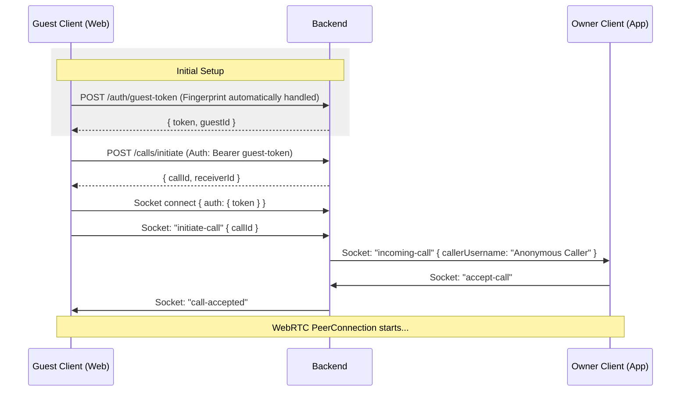

# 👤 Guest (Anonymous) Calling Flow

This document details how the frontend (web/mobile) should implement the anonymous calling feature using the secure, backend-generated guest JWT flow.

---

## 🏗️ Architecture Overview

Guest "accounts" are **ephemeral** and secured via a dedicated JWT.

- **Guest Identity**: Tied to a `guestId` (UUID) which is generated by the backend and wrapped in a JWT.
- **Device Fingerprinting**: The backend uses a hash of the `User-Agent` and `IP Address` to ensure that a guest receives the **same ID** if they reconnect, preventing block bypass.
- **Token Expiry**: Guest JWTs expire after **7 days**.
- **Permissions**: Guests can initiate calls but are strictly **prohibited from messaging**.

---

## 🛠️ Implementation Steps

### 1. Obtain a Guest Token

Before making any calls, the client must request a guest token.

- **Endpoint**: `POST /api/auth/guest-token`
- **Rate Limit**: 5 requests per minute / 100 requests per day per IP.

**Example Request:**

```javascript
const response = await axios.post('/api/auth/guest-token');
const { token, guestId } = response.data.data;

// Save to local storage for persistence
localStorage.setItem('guestToken', token);
```

### 2. REST API Authentication

Use the guest token in the `Authorization` header for all call-related endpoints (`/api/calls/*`).

- **Header:** `Authorization: Bearer <guest-token>`
- **Fallback (Deprecated):** `x-guest-id: <uuid>` (To be removed after migration).

**Example Request:**

```javascript
const response = await axios.post(
  '/api/calls/initiate',
  { qrToken: '...' },
  {
    headers: {
      Authorization: `Bearer ${localStorage.getItem('guestToken')}`,
    },
  }
);
```

### 3. Socket.io Authentication

Pass the guest token in the `auth` object during connection.

```javascript
const socket = io(SOCKET_URL, {
  auth: {
    token: localStorage.getItem('guestToken'), // The backend handles both user and guest JWTs here
  },
  transports: ['websocket'],
});
```

---

## 🚫 Messaging Restrictions

Anonymous users **cannot** send messages.

- If a guest JWT is used on `/api/messages`, the backend will return `403 Forbidden`.
- The UI should hide the "Chat" button for guest sessions.

---

## 📞 Call UI Considerations

### Caller (Guest) Perspective

- The caller doesn't need a profile.
- They wait for the "ringing" → "connected" transition.

### Receiver (Owner) Perspective

Incoming call payload:

- `callerUsername`: "Anonymous Caller"
- `callerId`: `guest:<uuid>`

The owner can **Block** this guest. The block is verified against both the `guestId` and the `IP address`.

---

## 🔄 Sequence Diagram



## 🧠 Backend Unified Identity (`req.identity`)

For developers working on the backend, always use `req.identity` instead of `req.user` or `req.guestId`.

The `req.identity` object is a discriminated union:

```typescript
type Identity =
  | { type: 'user'; userId: string; username: string }
  | { type: 'guest'; guestId: string; guestIp: string };
```

### Usage in Controllers:

```typescript
const identity = req.identity;

if (identity?.type === 'user') {
  // Logic for registered users
  const userId = identity.userId;
} else if (identity?.type === 'guest') {
  // Logic for anonymous guests
  const guestId = identity.guestId;
}
```

This ensures type safety and prevents "null-checks" for `req.user` across the codebase.

---

## 🛑 Security & Rate Limiting

1. **Fingerprint Protection**: If a guest clears their `localStorage` but has the same IP and User-Agent, they will receive the same `guestId`. This prevents them from bypassing an owner's block by simply refreshing the page.
2. **Global Cap**: If an IP makes > 100 guest token requests in a day, it is temporarily throttled.
3. **Strict Validation**: Guest tokens cannot be used to perform administrative or user-specific actions.
