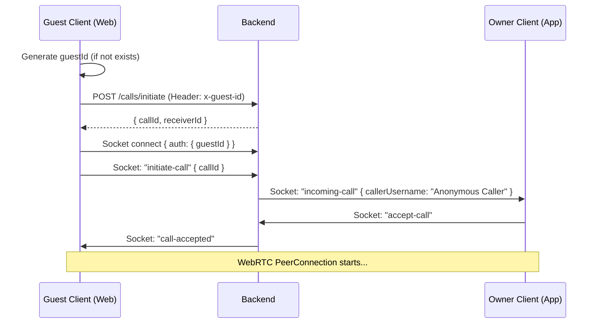

# 👤 Guest (Anonymous) Calling Flow

This document details how the frontend (web/mobile) should implement the anonymous calling feature for users who haven't registered or logged in.

---

## 🏗️ Architecture Overview

Guest "accounts" are **ephemeral** on the backend. They are not stored in the `users` table. Instead:

- The **Client** generates a unique `guestId` (UUID).
- The **Backend** uses this `guestId` + the user's **IP address** to identify sessions and enforce blocking.
- Guests are strictly **prohibited from messaging**.

---

## 🛠️ Implementation Steps

### 1. Generate & Persist Guest ID

When an unauthenticated user opens a QR scan link:

1. Check if a `guestId` exists in local storage.
2. If not, generate a UUID and save it.
3. This ID ensures that if the owner blocks this "guest," the block remains effective across multiple calls from the same device.

### 2. REST API Authentication

All call-related endpoints (`/api/calls/*`) now support guest access via a custom header.

- **Header:** `x-guest-id: <your-uuid>`
- **Endpoints supported:**
  - `POST /api/calls/initiate`: Start a new call.
  - `GET /api/calls/:callId`: Poll for status.
  - `PATCH /api/calls/:callId/end`: Terminate the call.
  - `PATCH /api/calls/:callId/reject`: Reject (if guest is receiving, though usually they are callers).

**Example Request:**

```javascript
const response = await axios.post(
  '/api/calls/initiate',
  {
    qrToken: '...',
  },
  {
    headers: {
      'x-guest-id': 'guest-uuid-12345',
    },
  }
);
```

### 3. Socket.io Authentication

To connect to the signaling server as a guest, pass the `guestId` in the `auth` object during connection.

```javascript
const socket = io(SOCKET_URL, {
  auth: {
    guestId: 'guest-uuid-12345',
  },
  transports: ['websocket'],
});
```

**Note:** The backend internally prefixes this as `guest:guest-uuid-12345` to distinguish it from registered user IDs.

---

## 🚫 Messaging Restrictions

Anonymous users **cannot** send messages.

- If a guest tries to access `/api/messages`, the backend will return `403 Forbidden`.
- The UI should hide the "Chat" button or show an "Install App to Message" prompt when the user is a guest.

---

## 📞 Call UI Considerations

### Caller (Guest) Perspective

- The caller doesn't need a profile.
- They simply wait for the "ringing" → "connected" transition.

### Receiver (Owner) Perspective

When an owner receives a call from a guest, the `incoming-call` socket event will have:

- `callerUsername`: "Anonymous Caller"
- `callerId`: `guest:<uuid>`

The owner can **Block** this guest. The backend will store the block against the `guestId` and the `IP address` used.

---

## 🔄 Sequence Diagram



---

## 🛑 Blocking Flow

If the owner blocks the guest:

1. The backend adds the `guestId` and `guestIp` to the `blocked_guests` table.
2. Future `initiateCall` requests from that `guestId` or `IP` will return `403 Forbidden`.
